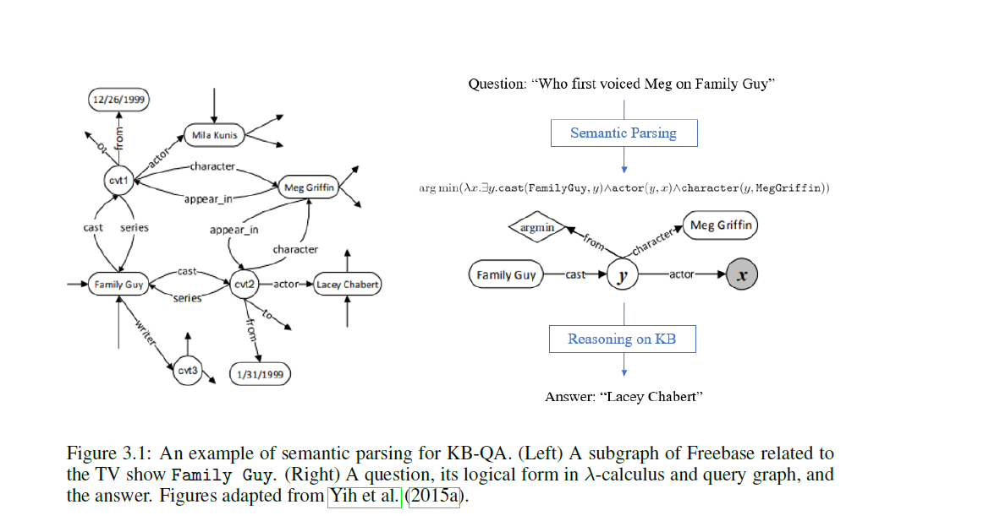

## Question Answering and Machine Reading Comprehension
寫在前面，本篇文章是同名论文的读后笔记。
### 缩写

KB-QA: knowledge base question answer,在KB中问问题，得到答案

text-QA: text question answer,在文档中问问题，得到答案

MRC: Machine Reading Comprehension 

TREC:Text REtrieval Conference 
### 都研究了什么呢

近来，KB-QA 和 text-QA的需求都很强。KB-QA比sql查询系统好用的多，用户不需要会sql语句，直接问问题就行。text-QA在移动端用起来，也比搜索引擎要好用，搜索引擎会列出好多页的查询结果，移动端翻阅起来总归不是很方便，text-QA却可以直接得出答案。

multi-turn QA（多回合问答）是新兴的研究方向，相对single-turn QA（单回合问答）来说，研究没辣么充分。这篇综述论文也重点关注single-turn QA，提到的论文也多是single-turn QA。但是，如果想搞定真实世界的对话系统，multi-turn QA是不可或缺的（比如闲聊和任务会话，天然是多回合QA）。

作者研究了一些kb，以及基于语义解析的采用symbolic方法的KB-QA。symbolic系统难以扩展，因为是基于关键字匹配的，弱于paraphrasing（？）。为了弥补这些局限，兴起了neural方法，用于表示查询，kb也得以使用连续的语义向量来表示，而不是离散的。因此，从查询到答案的推断，可以在语义层面的连续neural空间中进行。作者还研究了典型的多回合QA架构，以及会话式KB-QA。

neural text-QA agents的核心在于，neural Machine Reading
Comprehension (MRC) 模型，在给出的文章范围内，该模型根据给出的问题，从中得出答案。作者研究了流行的mrc数据集和trec text-QA的开放benchmark的结果，总结出最厉害的mrc模型技术包括两个方面，1.将问题和文章编码为neural向量 2.从neural 空间中得到答案（啊咧，这不是废话吗，我这个门外girl都可以想象，不然还能是啥？）

作者还研究了多回合会话式text-QA，以及mrc任务和模型怎样扩展到会话QA。
### 3.1 KB
 
KB是什么呢?将世界上的知识组织起来，存在数据库中，比如， DBPedia (Auer et al., 2007), Freebase (Bollacker et al., 2008) and Yago (Suchanek et al.,2007)。
KB是由subject-predicate-object triples (s; r; t)三元组组成的。
其中，s t是实体，r是关系，这种形式的KB因此也叫做知识图谱，节点和边连起来，就是图嘛。
### 3.2 KB-QA中的语义解析
理解本论文，原则上只做一级搜索理解。
最厉害的symbolic 方法，套路是，先语义解析，得出问题对应的逻辑表达式，下一步得出query graph，
最后得出多个目标路径，目标路径的目标节点既是答案。
这里举了个例子，谁先给Family Guy中的Meg配音的？看图可以很容易看出这个过程，首先得到问题对应的
λ表达式，然后根据表达式得到query graph。

symbolic方法有两个缺点。1 对于自然语言的解释，有可能匹配错误。2 KB规模比较大的时候，
搜索复杂度太高。
